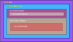

# Accordión

## Ilustración


## Estructura de cajas



## Template de angular

El template de angular esta construido a partir de dos componentes, por un lado esta el contenedor general que abarca todos los items y por otro lado está el template para cada uno de los items.

Template para el contenedor principal:

```html
<div [ngClass]="{'accordion': true, 'accordion-flush':flush}">
    <ng-content></ng-content>
</div>
```


Template para cada uno de los items:

```html
<div class="accordion-item">
    <h2 class="accordion-header" >
      <button [ngClass]="{'accordion-button':true, 'collapsed':!show}" type="button" (click)="chng()">
       {{ title }}
      </button>
    </h2>
    <div [ngClass]="{'accordion-collapse':true, 'collapse':true, 'fade':true, 'show':true}" #panel>
      <div class="accordion-body">
       <ng-content></ng-content>
      </div>
    </div>
  </div>
```

## Clases

El accordión no es personalizable a través de clases de **css**. Si existen dos tipos diferentes de accordión, el **estandar** o accordión común y el accordión **flush** el cual elimina bordes y fondo.

## Uso del accordión

Para hacer uso del **accordion** solo hace falta declarar el contenedor padre indicando si es **flush** o no, y luego cada uno de los items indicando el título y *opcional* se puede indicar si el item por defecto estará desplegado.

```html
<ngb-accordion [flush]="'true'">
	<ngb-accordion-item [title]="'item title'"[show]="true">
		<strong>This is the second item's accordion body.</strong> It is hidden by default, 		until the collapse plugin adds the appropriate classes that we use to style each 			element. These classes control the overall appearance, as well as the showing and 			hiding via CSS transitions. You can modify any of this with custom CSS or overriding 		 our default variables. It's also worth noting that just about any HTML can go within 		  the <code>.accordion-body</code>, though the transition does limit overflow.
	</ngb-accordion-item>
</ngb-accordion> 
```

## Inputs

Como el accordión esta construido a partir de dos componentes, también hay **Inputs** para cada uno de los componentes. A continuación se detallan los Inputs para cada uno de ellos

```jsx
/* Componente ngb-accordion */
[flush]="'true'" /* por defecto es false*/

/* Componente ngb-accordion-item */
[title]="'item title'"
[show]="true" /* por defecto es false*/
```

## Outputs

El accordion no tiene emision de eventos.

## Métodos

El comportamiento del accordión esta definido internamentes a través de sus métodos privados. No hay métodos públicos.