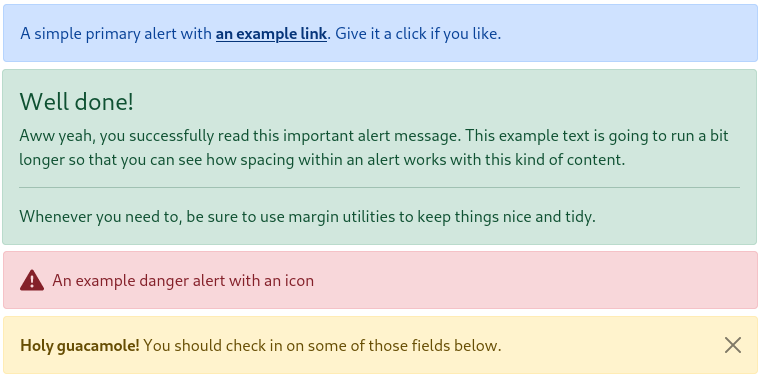
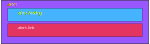

# Alert

## Ilustración



## Estructura de cajas



## Template de angular

```html
<div [ngClass]="{
'alert':true, 
'alert-primary': type=='primary', 
'alert-secondary': type == 'secondary', 
'alert-success': type == 'success',
'alert-danger': type == 'danger',
'alert-warning': type == 'warning',
'alert-info': type == 'info',
'alert-light': type == 'light',
'alert-dark': type == 'dark',
'd-flex': icon,
'align-items-center': icon,
'alert-dismissible': diss}">
<svg *ngIf="icon && type=='primary'" class="bi flex-shrink-0 me-2" width="24" height="24"><use xlink:href="#info-fill"/></svg>
<svg *ngIf="icon && type=='success'" class="bi flex-shrink-0 me-2" width="24" height="24"><use xlink:href="#check-circle-fill"/></svg>
<svg *ngIf="icon && type=='warning'" class="bi flex-shrink-0 me-2" width="24" height="24"><use xlink:href="#exclamation-triangle-fill"/></svg>
<svg *ngIf="icon && type=='danger'" class="bi flex-shrink-0 me-2" width="24" height="24"><use xlink:href="#exclamation-triangle-fill"/></svg>
<ng-content></ng-content> 
<button *ngIf="diss" type="button" class="btn-close" (click)="close()"></button>
</div>
```


## Clases

Existe en total 8 diferentes clases de alertas, sin embargo las clases no se definen por el input de clase como habitualmente se viene haciendo. En su lugar se definio un input denominado `type` que determina la clase del alert. Por ejemplo: si el input `[type]="'primary'"` entonces la clase será `alert-primary` y así con el resto de las clases, para cada type habrá una clase que le corresponde.

```jsx
alert-primary
alert-secondary
alert-success
alert-danger
alert-warning
alert-info
alert-light
alert-dark
```


## Uso del alert

Para hacer uso del `Alert`, el componente expone una **interface** la cual permite crear un array de alerts y hacer un binding entre la vista renderizada y el componente.

```typescript
export interface Alert{
  type: string,
  diss: boolean,
  icon: boolean,
  mssg: string
}
```


Un ejemplo de un array podria ser como el siguiente:

```typescript
alertas: Alert[] = [
    { type: 'primary', diss: true, icon: true, mssg: 'An example primary alert with an icon' },
    { type: 'success', diss: true, icon: true, mssg: 'An example success alert with an icon' },
    { type: 'danger', diss: true, icon: true, mssg: 'An example danger alert with an icon' },
    { type: 'warning', diss: true, icon: true, mssg: 'An example warning alert with an icon' }
  ]

/* Un método permite quitar alertas del array, este se usará en el caso de que se quiera quitar un alerta  */
closeAlert(alert: Alert) {
    this.alertas.splice(this.alertsd.indexOf(alert), 1);
  }
```


```html
<!-- Para mostrar las alertas hacemos uso de la directiva *ngFor 
a través del evento (closed) sabemos si el alert se cerro a través del boton close-button y de esa manera utilizamos el metodo definido en el componente padre.
-->
<span *ngFor="let alert of alertsd">
 	<ngb-alert [type]="alert.type" [diss]="alert.diss" [icon]="alert.icon" (closed)="closeAlert(alert)">
        <strong>Holy guacamole!</strong> You should check in on some of those fields below.
    </ngb-alert>
</span>
```

## Inputs

El componente `Alert` tiene tres **inputs**

```javascript
/* type primary | secondary | success | danger | warning | info | light | dark */
[type]="'primary'" 

/* dissmisible true | false */
[diss]="true"

/* icon true | false */
[icon]="true"
```


## Outputs

Partiendo que tenemos un array de alertas, y sabiendo que si quitamos uno del mismo automáticamente será retirado tambien de la vista, tenemos un evento que nos notifica cuando el alerta es cerrado a través del botón `button-close` con lo cual podemos usar este evento para quitar el alerta.

```
(closed)="closeAlert(alert)"
```


## Métodos

El alert no tiene métodos públicos.
