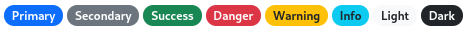

# Badge

## Ilustración


## Estructuras de cajas


## Template de angular
```html
<span [ngClass]="clase.length > 0 ? ['badge'].concat(clase) : ['badge']">
    <ng-content></ng-content>
</span>
```
## Clases
El badge admite distintas clases que permiten personalizar tanto su forma como su posicion, color, color de texto, etc. El archivo `baseType.ts` contiene las clases organizadas por propósito. En este caso serán enumeradas las clases separadas por tipo.
```jsx
/** Background types */                
'bg-primary'|'bg-secondary'|'bg-success'|'bg-info'|'bg-warning'|'bg-danger'|'bg-light'|'bg-dark'|'bg-black'|'bg-white'|'bg-body'|'bg-transparent '|'bg-opacity-10'|'bg-opacity-25'|'bg-opacity-50'|'bg-opacity-75'|'bg-opacity-100 '|'bg-gradient'


/** position type */
'position-static' | 'position-relative' | 'position-absolute' | 'position-fixed' | 'position-sticky'

/** Border types */
'border'|'border-0'|'border-top'|'border-top-0'|'border-end'|'border-end-0'|'border-bottom'|'border-bottom-0'|'border-start'|'border-start-0'|'border-primary'|'border-secondary'|'border-success'|'border-info'|'border-warning'|'border-danger'|'border-light'|'border-dark'|'border-white'|'border-1'|'border-2'|'border-3'|'border-4'|'border-5'

/** Margin types */
'mw-100'|'m-0'|'m-1'|'m-2'|'m-3'|'m-4'|'m-5'|'m-auto'|'mx-0'|'mx-1'|'mx-2'|'mx-3'|'mx-4'|'mx-5'|'mx-auto'|'my-0'|'my-1'|'my-2'|'my-3'|'my-4'|'my-5'|'my-auto'|'mt-0'|'mt-1'|'mt-2'|'mt-3'|'mt-4'|'mt-5'|'mt-auto'|'me-0'|'me-1'|'me-2'|'me-3'|'me-4'|'me-5'|'me-auto'|'mb-0'|'mb-1'|'mb-2'|'mb-3'|'mb-4'|'mb-5'|'mb-auto'|'ms-0'|'ms-1'|'ms-2'|'ms-3'|'ms-4'|'ms-5'|'ms-auto'

/** Padding types */
'p-0'|'p-1'|'p-2'|'p-3'|'p-4'|'p-5'|'px-0'|'px-1'|'px-2'|'px-3'|'px-4'|'px-5'|'py-0'|'py-1'|'py-2'|'py-3'|'py-4'|'py-5'|'pt-0'|'pt-1'|'pt-2'|'pt-3'|'pt-4'|'pt-5'|'pe-0'|'pe-1'|'pe-2'|'pe-3'|'pe-4'|'pe-5'|'pb-0'|'pb-1'|'pb-2'|'pb-3'|'pb-4'|'pb-5'|'ps-0'|'ps-1'|'ps-2'|'ps-3'|'ps-4'|'ps-5'

/** moviment type */
'top-0' | 'top-50' | 'top-100' | 'bottom-0' | 'bottom-50' | 'bottom-100' | 'start-0' | 'start-50' | 'start-100' | 'end-0' | 'end-50' | 'end-100'

/** rounded type */
'rounded'|'rounded-0'|'rounded-1'|'rounded-2'|'rounded-3'|'rounded-circle'|'rounded-pill'|'rounded-top'|'rounded-end'|'rounded-bottom'|'rounded-start'

/** translate type */
'translate-middle' | 'translate-middle-x' | 'translate-middle-y'

/** Text color types*/
'text-primary'|'text-secondary'|'text-success'|'text-info'|'text-warning'|'text-danger'|'text-light'|'text-dark'|'text-black'|'text-white'
```

## Modo de uso
```html
<ngb-badge [clss]="['bg-primary']">Texto</ngb-badge>
```
## Inputs
El badge tiene un único **input** el cual puede ser de cualquiera de los tipos que figuran en el apartado de clases
```jsx
/** types brdrType bgType textColrType mrgnType pddgType pstnType mvmnType rnddType trltType*/
[clss]="['bg-primary', 'rounded-pill', 'translate-middle']"
```

## Outputs
El componente no tiene outputs

## Metodos
El componente badge no tiene métodos públicos


