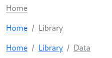
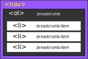

# Breadcrumb

## Tabla de contenido
- [Breadcrumb](#breadcrumb)
  - [Tabla de contenido](#tabla-de-contenido)
  - [Ilustración](#ilustración)
  - [Estructura de cajas](#estructura-de-cajas)
  - [Template de angular](#template-de-angular)
  - [Clases](#clases)
  - [Modo de uso](#modo-de-uso)
  - [Input](#input)
  - [Output](#output)
  - [Metodos](#metodos)


## Ilustración



## Estructura de cajas



## Template de angular

```html
<nav>
  <ol class="breadcrumb" >
    <li [ngClass]="{
      'breadcrumb-item': true, 
      'active': item.active, 
      'breadcrumb-item-bar': bar, 
      'breadcrumb-item-quote': dvdr==quote,
      'breadcrumb-item-none': dvdr==none
    }" *ngFor="let item of items;">
      <a href="#">{{ item.text }}</a>
    </li>
  </ol>
</nav>
```

## Clases

El **Breadcrumb** no es suceptible de modificación a través del uso de clases.

## Modo de uso

Para hacer uso del breadcrumb primero hay que crear un array con los items del mismo. Para los items hay una interface definida que se denomina brdcitem

```javascript
export interface brdcitem {
  active: boolean,
  link: string,
  text: string
}
```

cada item debe indicar, si esta activo o no, cual es el link que se abrirá en caso de hacer click sobre el mismo y cual es el texto que informará en pantalla.

Para crear un breadcrumb lo hacemos de la siguiente manera:

```html
<ngb-breadcrumb [itms]="items"[dvdr]="bar"> </ngb-breadcrumb> 
```

pasándole como parámetros al componente el listado de **items** y cual sera el **divider** utilizado. En cuanto a los divider se definieron tres tipos de divider a traves de un enum, el mismo puede ser invocado desde cualquier lugar y se define como sigue:

```javascript
export enum DvdrEnum {
    BAR = 1,
    QUOTE = 2,
    NONE = 3
}
```

## Input

El **breadcrumb**  admite dos inputs, por un lado el listado de items que componen el mismo, y por otro lados el divider que se utilizará, el cual puede ser `BAR`, `QUOTE` o `NONE`.

```jsx
/* [{text: "Home",active: false,link: "#"},{text: "Library",active: true,link: "#"}] */
[itms]="items"

/* DvdrEnum.BAR | DvdrEnum.QUOTE | DvdrEnum.NONE*/
[dvdr]="bar"
```

## Output

El **breadcrumb** no contiene outputs

## Metodos

No se definieron métodos