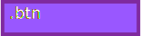

# Button


## Tabla de contenido

- [Button](#button)
  - [Tabla de contenido](#tabla-de-contenido)
  - [Ilustración](#ilustración)
  - [Estructura de cajas](#estructura-de-cajas)
  - [Template de angular](#template-de-angular)
  - [Clases](#clases)
  - [Uso del button](#uso-del-button)
  - [Inputs](#inputs)
  - [Output](#output)
  - [Métodos](#métodos)


## Ilustración


## Estructura de cajas




## Template de angular

```html
<button type="button" [ngClass]="disabled ? ['disabled'].concat(clase) : clase" (click)="clckBttn()" [disabled]="disabled">
    <ng-content></ng-content>
</button>
```


## Clases

Los botones admiten un conjunto de clases que le dan personalización, las clases admitidas son las mismas que se utilizan en **Bootstrap**.

A continuación se detallan las clases posibles:

```jsx
.btn 
.btn-close 

.btn-primary 
.btn-secondary 
.btn-success 
.btn-danger 
.btn-warning 
.btn-info 
.btn-light 
.btn-dark 
.btn-link
.btn-outline-primary 
.btn-outline-secondary 
.btn-outline-success 
.btn-outline-danger 
.btn-outline-warning 
.btn-outline-info
.btn-outline-light 
.btn-outline-dark

.btn-lg 
.btn-sm 
```


## Uso del button

El boton tiene un único input y un unico output que es el evento click, con ese evento posteriormente decidimos que función es invocada.

```html
 <ngb-button [clss]="['btn', 'btn-danger']" [dsbl]="false" (clck)="function()" style="border-color:blue" >Danger</ngb-button>
```


## Inputs

El `button` tiene dos inputs, la clase por un lado y si es disabled.

```jsx
[clss]="['btn', 'btn-danger']" 

[dsbl]="true"
```


## Output

Tiene un único output, en el cuál notifica cuando el boton es presionado

```jsx
(clck)="function()"
```


## Métodos

El button no expone métodos.

