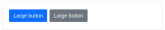

# Button


## Clases

Los botones admiten un conjunto de clases que le dan personalización, las clases admitidas son las mismas que se utilizan en **Bootstrap**.

A continuación se detallan las clases posibles:

```jsx
.btn 
.btn-close 

.btn-primary 
.btn-secondary 
.btn-success 
.btn-danger 
.btn-warning 
.btn-info 
.btn-light 
.btn-dark 
.btn-link
.btn-outline-primary 
.btn-outline-secondary 
.btn-outline-success 
.btn-outline-danger 
.btn-outline-warning 
.btn-outline-info
.btn-outline-light 
.btn-outline-dark

.btn-lg 
.btn-sm 
```


## Uso del button

Se ilustra a continuación el uso del button con cada una de las clases de **bootstrap**

#### Button examples


```html
<ngb-button [clss]="['btn', 'btn-primary']">Primary</ngb-button>
<ngb-button [clss]="['btn', 'btn-secondary']">Secondary</ngb-button>
<ngb-button [clss]="['btn', 'btn-success']">Success</ngb-button>
<ngb-button [clss]="['btn', 'btn-danger']">Danger</ngb-button>
<ngb-button [clss]="['btn', 'btn-warning']">Warning</ngb-button>
<ngb-button [clss]="['btn', 'btn-info']">Info</ngb-button>
<ngb-button [clss]="['btn', 'btn-light']">Light</ngb-button>
<ngb-button [clss]="['btn', 'btn-dark']">Dark</ngb-button>
<ngb-button [clss]="['btn', 'btn-link']">Link</ngb-button>
```


#### Outline buttons


```html
<ngb-button [clss]="['btn', 'btn-outline-primary']">Primary</ngb-button>
<ngb-button [clss]="['btn', 'btn-outline-secondary']">Secondary</ngb-button>
<ngb-button [clss]="['btn', 'btn-outline-success']">Success</ngb-button>
<ngb-button [clss]="['btn', 'btn-outline-danger']">Danger</ngb-button>
<ngb-button [clss]="['btn', 'btn-outline-warning']">Warning</ngb-button>
<ngb-button [clss]="['btn', 'btn-outline-info']">Info</ngb-button>
<ngb-button [clss]="['btn', 'btn-outline-light']">Light</ngb-button>
<ngb-button [clss]="['btn', 'btn-outline-dark']">Dark</ngb-button>
```


#### Sizes

Los botones admiten dos tipos de tamaño, con las clases **sm** y **lg** respectivamente.


```html
<ngb-button [clss]="['btn', 'btn-primary', 'btn-sm']">Small button</ngb-button>
<ngb-button [clss]="['btn', 'btn-secondary', 'btn-sm']">Small button</ngb-button>
```




```html
<ngb-button [clss]="['btn', 'btn-primary', 'btn-lg']">Large button</ngb-button>
<ngb-button [clss]="['btn', 'btn-secondary', 'btn-lg']">Large button</ngb-button>
```


#### Disabled


```html
<ngb-button [clss]="['btn', 'btn-lg', 'btn-primary']" [dsbl]="true">Primary button</ngb-button>
<ngb-button [clss]="['btn', 'btn-secondary', 'btn-lg']" [dsbl]="true">Button</ngb-button>
```


## Inputs

El `button` tiene dos inputs, la clase por un lado y si es disabled.

```jsx
[clss]="['btn', 'btn-danger']" 

[dsbl]="true"
```


## Output

Tiene un único output, en el cual notifica cuando el boton es presionado

```jsx
(clck)="function()"
```


## Metodos

El button no expone métodos.

