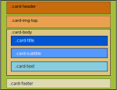

# Card


## Tabla de contenido

- [Card](#card)
  - [Tabla de contenido](#tabla-de-contenido)
  - [Ilustración](#ilustración)
  - [Estructura de cajas](#estructura-de-cajas)
  - [Template de angular](#template-de-angular)
  - [Clases](#clases)
  - [Uso de la card](#uso-de-la-card)
  - [Inputs](#inputs)
  - [Output](#output)
  - [Métodos](#métodos)


## Ilustración


## Estructura de cajas




## Template de angular

```html
<div [ngClass]="['card'].concat(clase)" >
    <ng-content ></ng-content>
</div>
```


## Clases

Las card admiten todo el conjunto de clases del basetype por lo tanto las posibilidades son muchas

A continuación se detallan las clases posibles:

```jsx
border, border-0, border-top, border-top-0, border-end, border-end-0, border-bottom, border-bottom-0, border-start
border-start-0, border-primary, border-secondary, border-success, border-info, border-warning, border-danger, border-light       border-dark, border-white, border-1, border-2, border-3, border-4, border-5, w-25, w-50, w-75, w-100, w-auto, mw-100,             
vw-100, min-vw-100, h-25, h-50, h-75, h-100, h-auto, mh-100, vh-100, min-vh-100, text-start, text-end, text-center
text-primary, text-secondary, text-success, text-info, text-warning, text-danger, text-light, text-dark, text-black, text-white
m-0, m-1, m-2, m-3, m-4, m-5, m-auto, mx-0, mx-1, mx-2, mx-3, mx-4, mx-5, mx-auto, my-0, my-1, my-2, my-3, my-4, my-5
my-auto, mt-0, mt-1, mt-2, mt-3, mt-4, mt-5, mt-auto, me-0, me-1, me-2, me-3, me-4, me-5, me-auto, mb-0, mb-1, mb-2, mb-3
mb-4, mb-5, mb-auto, ms-0, ms-1, ms-2, ms-3, ms-4, ms-5, ms-auto, p-0, p-1, p-2, p-3, p-4, p-5, px-0, px-1, px-2
px-3, px-4, px-5, py-0, py-1, py-2, py-3, py-4, py-5, pt-0, pt-1, pt-2, pt-3, pt-4, pt-5, pe-0, pe-1, pe-2, pe-3
pe-4, pe-5, pb-0, pb-1, pb-2, pb-3, pb-4, pb-5, ps-0, ps-1, ps-2, ps-3, ps-4, ps-5, font-monospace, fs-1, fs-2
fs-3, fs-4, fs-5, fs-6, fst-italic, fst-normal, fw-light, fw-lighter, fw-normal, fw-bold, fw-bolder
bg-primary, bg-secondary, bg-success, bg-info, bg-warning, bg-danger, bg-light, bg-dark, bg-black, bg-white, bg-body
bg-transparent , bg-opacity-10, bg-opacity-25, bg-opacity-50, bg-opacity-75, bg-opacity-100 , bg-gradient
```


## Uso de la card

Las cards son elementos informativos, por lo tanto no hay eventos asociados a ellas, si en cambio permite el uso de 

```html
 <ngb-card [clss]="['text-white', 'bg-success', 'mb-3']">
    
    <div class="card-body">
        <h5 class="card-title">Card title</h5>
        <p class="card-text">This is a wider card with supporting text below as a natural lead-in to
                                additional content. This content is a little bit longer.</p>
        <p class="card-text"><small class="text-muted">Last updated 3 mins ago</small></p>
     </div>
 </ngb-card>
```


## Inputs

La `card`  tiene un único input en el cual recibe el estilo.

```jsx
[clss]="['text-white', 'bg-success', 'mb-3']" 
```


## Output

Las cards no tienen eventos asociados, ya que son elementos pasivos dentro de una interface


## Métodos

Las cards no exponen métodos.

