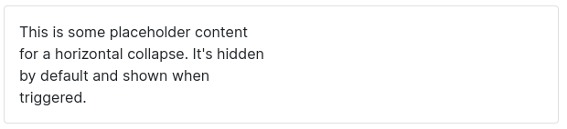

# Collapse

## Tabla de contenido
- [Collapse](#collapse)
  - [Tabla de contenido](#tabla-de-contenido)
  - [Ilustración](#ilustración)
  - [Estructura de cajas](#estructura-de-cajas)
  - [Template de angular](#template-de-angular)
  - [clases](#clases)
  - [Uso del collapse](#uso-del-collapse)
  - [Inputs](#inputs)
  - [Outputs](#outputs)
  - [Métodos](#métodos)


## Ilustración



## Estructura de cajas


## Template de angular

El template de angular esta construido por un `div` . Todos los eventos del collapse e incluso la animación estan construidos a partir de animaciones de **css**. La clase `.collapse` es la que contiene las animaciones del panel, por otro lado las clases `.collapse-horizontal` y `.collapse-vertical` aportan información sobre el `max-height` y `max-width` respectivamente y la clase `.show` tiene la responsabilidad de mostrar el  contenedor.

```html
<div [ngClass]="{'collapse':true, 'collapse-vertical':!hrzn, 'collapse-horizontal':hrzn,'show':true}" #panel>
   <ng-content></ng-content>
</div>
```

## clases

No admite el ingreso de clases

## Uso del collapse

Colocamos un botón, cuyo evento click llama a la función `tgle()` de la variable `collapse`

```html
<ngb-button [clss]="['btn', 'btn-primary']" (clck)="collapse.tgle()">Toggle height collapse</ngb-button>
```

Colocamos el componente **collapse** y definimos la dirección, el max-vh y el time, aunque estos valores son opcionales.

```html
<ngb-collapse #collapse [hrzn]="true">
    <div class="col-6">
       <ngb-card style="overflow: hidden;">
            <div class="card card-body" style="width: 300px; word-wrap: break-word;">
                      This is some placeholder content for a horizontal collapse. 
                        It's hidden by default and shown when triggered. 
             </div>
        </ngb-card>
     </div>
 </ngb-collapse>
```


## Inputs

El collapse admite un inputs, para indicar si el collapse será mostrado en dirección horizontal o vertical. Para ello, el input se indica como `[hrzn]` y admite un valor `boolean` para indicar si es true el contenedor se contraerá y desplegará en dirección vertical. El valor por **defecto** es false, es decir que por defecto el panel se muestra en dirección vertical.

```jsx
<!-- horizontal true | false -->
[hrzn]="true" 

```


## Outputs

No expone **outputs**.


## Métodos

El collapse, tiene un único método es el de toggle que permite cambiar el estado entre show e hide.

- `tgle()` Cambia el estado entre show e hidden.
