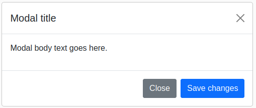
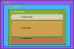

# Modal


## Tabla de contenido

- [Modal](#modal)
  - [Tabla de contenido](#tabla-de-contenido)
  - [Ilustración](#ilustración)
  - [Estructura de cajas](#estructura-de-cajas)
  - [Template de angular](#template-de-angular)
  - [clases](#clases)
  - [uso del modal](#uso-del-modal)
  - [Inputs](#inputs)
  - [Output](#output)
  - [Metodos](#metodos)

## Ilustración




## Estructura de cajas




## Template de angular

El template de angular esta contruido con las cajas `.modal`, `.modal-dialog`, `.modal-content`, el resto de cajas serán ingresadas en el componente en el que se use según los requerimientos de la vista.

```html
<div [@stateModal]="isOpen ? 'show' : 'hide'" class="modal" [ngStyle]="isOpen ? {display: 'block'} : {display:'none'}">
    <div  [ngClass]="['modal-dialog', width]">
      <div class="modal-content">
        <ng-content></ng-content>        
      </div>
    </div>
</div>
<div #backdrop class="modal-backdrop" style="display: none;"></div>
```

La clase `.modal-backdrop` es una caja que cubre toda la pantalla con una `opacity:0.5` dandole al fondo un color mas oscuro cuando el modal se abre.


## clases

La caja de `.modal-dialog` admite varias clases adicionales que permiten el scroll, o que el modal ocupe toda la pantalla.

Las clases posibles son:

```html
.modal-dialog-scrollable
.modal-dialog-centered
.modal-xl
.modal-lg
.modal-sm
.modal-fullscreen
.modal-fullscreen-sm-down
.modal-fullscreen-md-down
.modal-fullscreen-lg-down
.modal-fullscreen-xl-down
.modal-fullscreen-xxl-down
```


## uso del modal

Un boton puede abrir y cerrar el modal

```html
<!-- boton para abrir el modal-->
<ngb-button [clss]="['btn', 'btn-primary']" (clck)="modal.tgle()">Toggle</ngb-button>

<!-- boton para obtener el estado del modal -->
<!-- a traves del output (stat) -->
  <ngb-button [clss]="['btn', 'btn-danger']" (clck)="modal._getStat()">cerrar</ngb-button>
```


```html
<ngb-modal #modal [c]="['modal-dialog-scrollable','modal-dialog-centered']" (stat)="mostrarEstado($event)">
    <div class="modal-header">
      <h5 class="modal-title" id="staticBackdropLabel">Modal title</h5>
      <ngb-button [clss]="['btn-close']" (clck)="modal.tgle()"></ngb-button>
    </div>
    <div class="modal-body">
    ...
    </div>
    <div class="modal-footer">
      <ngb-button [clss]="['btn btn-secondary']" (clck)="modal.tgle()">Close</ngb-button>
      <ngb-button [clss]="['btn btn-primary']">Save changes</ngb-button>
    </div>
    </ngb-modal>
```


## Inputs

El modal tiene un único input que es un array de string en el que admite solamente valores propios de `.modal-dialog`

```htm
[dlog]="['modal-dialog-scrollable','modal-dialog-centered']"
```


## Output

El modal tiene un único output en el que informa su estado, los valores posibles son *open* y *close* respectivamente y lo hace en el output **stat**.

```html
(stat)="funcion($event)"
```


## Metodos

El modal posee dos métodos:

- `tgle()` que cambia el estado del modal entre 'open/close'. y el método
-  `_getStat()` que retorna el estado del modal en formato string. 

