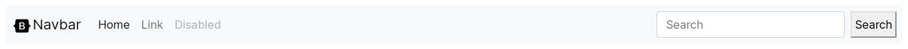
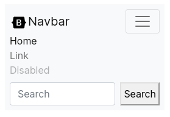
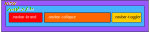

# Navbar

## Tabla de contenido
- [Navbar](#navbar)
  - [Tabla de contenido](#tabla-de-contenido)
  - [Ilustracion](#ilustracion)
  - [Estructura de cajas](#estructura-de-cajas)
  - [Template de angular](#template-de-angular)
  - [clases](#clases)
  - [Uso del navbar](#uso-del-navbar)
  - [Inputs](#inputs-1)
  - [Output](#output)
  - [Metodos](#metodos)
  
  

## Ilustracion





## Estructura de cajas




## Template de angular

```html
<nav [ngClass]="clss==undefined? ['navbar'] : ['navbar'].concat(clss)">
  <div class="container-fluid">
    <!-- conditional div -->
 <div *ngIf="side == 'left'">
  <button class="navbar-toggler" id="leftbtn" type="button" (click)="tgle()">
    <span class="navbar-toggler-icon"></span>
  </button>
 </div>


    <a class="navbar-brand" href="#" #brndCntr></a>

    <div *ngIf="side == 'right'">
      <button class="navbar-toggler" id="rightbtn" type="button" (click)="tgle()">
        <span class="navbar-toggler-icon"></span>
      </button>
     </div>

    <div [ngClass]="{'collapse': clps, 'navbar-collapse':true}">
      <ng-content></ng-content>
    </div>

  </div>
</nav>
```


## clases

```
.navbar-expand{-sm|-md|-lg|-xl|-xxl} 
.navbar-light 
.navbar-dark
[BgType]
[fxedType]
[mrgnType]
```


## Uso del navbar

```html
<ngb-navbar 
            [side]="'right'" 
            [clss]="['navbar-expand-lg', 'navbar-light', 'bg-light']" 
            [brnd]="{text: 'Navbar', imag: 'https://simpleicons.org/icons/bootstrap.svg'}">
    <!-- ng-content -->
               <ul class="navbar-nav me-auto mb-2 mb-lg-0">
                   <li class="nav-item">
                       <a class="nav-link active" aria-current="page" href="#">Home</a>
                   </li>
                   <li class="nav-item">
                       <a class="nav-link" href="#">Link</a>
                   </li>
                   <li class="nav-item">
                       <a class="nav-link disabled">Disabled</a>
                   </li>
               </ul>
               <form class="d-flex">
                   <input class="form-control me-2" type="search" placeholder="Search" aria-label="Search">
                   <button class="btn btn-outline-success" type="submit">Search</button>
               </form>
    <!-- #END n -->
</ngb-navbar>
```


## Inputs

El `navbar` tiene **cuatro** Inputs, el `side` que permite indicar de que lado ira ubicado el boton de toggler respecto del brand, la `clss` que nos indica la clase del navbar, esto permite la personalización del navbar, como el color de fondo, la posición, etc y el `brnd` que recibe un texto y una imagen, esto es porque el brand permite mostrar una imagen. En el caso de que no se quiera mostrar una imagen basta con que el elemento `imag` contenga la cadena vacia ''. También tiene un input denominado `prpt` con el que se le puede pasar un objeto con estilos

```javascript
/** side {'left' | 'right'} */
[side]="'left'"

/** clss {'navbar-expand-sm' |'navbar-expand-md' |'navbar-expand-lg' |'navbar-expand-xl' |'navbar-expand-xxl' | 'navbar-light' | 'navbar-dark' |bgType | fxedType} */
[clss]="['navbar-expand-lg', 'navbar-light', 'bg-light']"

/** type brandType = mrgnType |'h1'| 'h2'|'h3'|'h4'|'h5'|'h6' */
[brnd]="{text: 'Navbar', clss:[], imag: 'https://simpleicons.org/icons/bootstrap.svg'}"

[prpt]="{'background-color': '#e3f2fd'}"
```


## Output

El `navbar` no expone eventos ya que su comportamiento estaría dentro del collapse.


## Metodos

El `navbar` no expone métodos.

