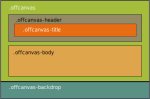

# Offcanvas

## Tabla de contenido
- [Offcanvas](#offcanvas)
  - [Tabla de contenido](#tabla-de-contenido)
  - [Ilustración](#ilustración)
  - [Estructura de cajas](#estructura-de-cajas)
  - [Template de angular](#template-de-angular)
  - [clases](#clases)
  - [uso del offcanvas](#uso-del-offcanvas)
  - [Inputs](#inputs)
  - [Output](#output)
  - [Métodos](#métodos)


## Ilustración


## Estructura de cajas




## Template de angular

El template de angular esta construido con el contenedor principal `.offcanvas` y con el `.offcanvas-backdrop`

```html
<div [ngClass]="{'offcanvas':true, 'show':show, 'offcanvas-start':offstart, 'offcanvas-end':offend, 'offcanvas-top': offtop, 'offcanvas-bottom':offbottom}" #offcanvas>
    <ng-content></ng-content>
</div>

<div class="offcanvas-backdrop show" *ngIf="show && backdrop"></div>
```

La clase `.offcanvas-backdrop` es una caja que cubre toda la pantalla con una `opacity:0.5` dandole al fondo un color mas oscuro cuando el modal se abre.


## clases

El `offcanvas` acepta cuatro clases, las cuales indican la ubicación del `offcanvas`, estas son en la izquierda, derecha, arriba o abajo.

Las clases posibles son:

```html
.offcanvas-start
.offcanvas-end
.offcanvas-top
.offcanvas-bottom
```


## uso del offcanvas

Un boton puede abrir y cerrar el offcanvas a través del método `tgle()`. Para ello hemos de usar `#name` para que el componente sea almacenado en una variable, y de esa manera desde el boton podemos invocar sus métodos.

```html
<!-- boton para abrir el offcanvas-->
<ngb-button [clss]="['btn', 'btn-primary']" (clck)="offcanvas.tgle()">Toggle</ngb-button>
```

```html
<!-- offcanvas body scroller without backdrop -->
<ngb-offcanvas #offcanvas [clss]="'offcanvas-start'">
   <div class="offcanvas-header">
      <h5 class="offcanvas-title">Offcanvas title</h5>
      <ngb-button [clss]="['btn-close']" (click)="offscroll.tgle()"></ngb-button>
   </div>
   <div class="offcanvas-body">
        <div>
        Some text as placeholder. In real life you can have the elements you have chosen. 			Like, text, images,
        lists, etc.
        </div>
   </div>
</ngb-offcanvas>
```


## Inputs

El **offcanvas** acepta tres tipos de inputs para configurar su comportamiento, el primer input es `clss`el cual permite determinar la ubicación del elemento en la pantalla, el segundo `scrl` permite determinar si el `body` seguirá scrolleando o quedará congelado. Por último el input `bkdp` permite activar o no el `backdrop`.

```jsx
[clss]="'offcanvas-start' | 'offcanvas-end' | 'offcanvas-top' | 'offcanvas-bottom'"
[scrl]="true | false"
[bkdp]="true | false"
```

## Output

No se configuraron **outputs** para el elemento `offcanvas`.

## Métodos

El offcanvas tiene dos métodos:

- `tgle()` que cambia el estado del modal entre 'open/close'.
- `clse()`  Si el offcanvas esta `open` pasará a estado `close`. Pero si está en estado `close` entonces permanecerá en ese estado.

