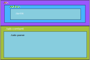

# Tab

## Tabla de contenido
- [Tab](#tab)
  - [Tabla de contenido](#tabla-de-contenido)
  - [Ilustración](#ilustración)
  - [Estructura de Cajas](#estructura-de-cajas)
  - [Template de Angular](#template-de-angular)
      - [tab Component](#tab-component)
      - [tab-panel Component](#tab-panel-component)
      - [tab-service](#tab-service)
      - [tablink](#tablink)
  - [Clases](#clases)
  - [Uso del Tab](#uso-del-tab)
  - [Inputs](#inputs)
  - [Outputs](#outputs)
  - [Métodos](#métodos)

## Ilustración


## Estructura de Cajas




## Template de Angular

Antes de avanzar en el detalle de los templates vamos a explicar como es el funcionamiento del `tab` y el porque de tener tres partes, *dos* `componentes` y *un* `sevicio`. El flujo de trabajo es el siguiente:

el `componente` `Tab` recibe un array de `tablink` desde el componente padre, con el cual armará el listados de pestañas que tendrá el `tab` y alamcena en su interior dicho array, cuando una pestaña es clickeada, el `tablink` correspondiente se marca como **active** lo que hace que quede seleccionada. Sin embargo, no existe una forma directa en la cual el `tab` sepa cual `tab-panel` mostrar. Aqui es donde entra en juego el `tab-service`, cuando una de las tabs es clickeada, el componente `tab` envia al servicio el `tablink` de la tab clickeada. A su vez, todos los `tab-panel` estas **subscritos** al servicio con lo cual se enteran de que hubo un evento, ahora bien cada `tab-panel`es inicializado con uno de los `tablink` con lo cual, aquel que fue inicializado con el mismo que surgió del evento será el que se muestre.


#### tab Component

```html
<ul [ngClass]="clss!=undefined ? ['nav'].concat(clss) : ['nav']">
  <li class="nav-item" *ngFor="let link of links; index as indx">
    <a href="#" [ngClass]="{'nav-link':true, 'active': link.actv, 'disabled': link.dsbl}" (click)="chng(indx)">{{ link.nmbr }}</a>
  </li>
  
</ul>
<div class="tab-content">
  <ng-content></ng-content>
</div>
```

#### tab-panel Component

```html
<div [ngClass]="{'tab-pane': true, 'show': dspl, 'hidden': !dspl}"><ng-content></ng-content></div>
```

#### tab-service

```javascript
 getActive():Observable<tablink>{
    return this.tabSources.asObservable();
  }

  
  active(value:tablink){
    this.tabSources.next(value);
```

#### tablink

```javascript
export interface tablink{
  id:number;
  nmbr:string;
  actv:boolean;
  dsbl:boolean;
  chnl:number;
  href: string
}
```


## Clases

El componente `tab` admite las siguientes clases, como también admite los siguientes types:  **flexDrtnType** ,  **jstfCntnType**

```
.nav-tabs
.nav-pills
.nav-fill
```


## Uso del Tab

Primero hemos de crear el array de `tablink` que van a formar las `tabs`.

Es posible tener varias tabs en una misma pantalla, pero aunque sean distintos componentes el servicio que redistribuye los estados es el mismo. Esto da pie para explicar el mecanismo de distribución de la información relativa a las tabs. Dado que cuando se clickea una tab, esta es entregada al servicio y luego todos los tab-panel que estan observando se enteran del evento. Sin embargo un tab panel esta escuchando en un determinado canal, si la tab observada no esta en su canal directamente es ignorada. En cambio si la misma esta en el canal en el cual ha sido configurado el panel este la procesara y segun si el id de la tab clickeada coincide con el suyo cambiara su estado.

```javascript
base:tablink[] = [
    {id:1, nmbr:"Active", actv:true, dsbl: false, chnl: 1, href:"route"},
    {id:2, nmbr:"Link", actv:false, dsbl:false, chnl: 1, href:""},
    {id:3, nmbr:"Link", actv: false, dsbl:false, chnl: 1, href:""},
    {id:4, nmbr:"Disabled", actv:false, dsbl:true, chnl: 1, href:""}
  ]

```

Una vez creado el array, implementamos el selector

```html
<ngb-tab [lnks]="links" [clss]="['nav-tabs']" (evnt)="chngTabs($event)">
    <ngb-tab-panel [init]="links[0]">
        Lorem Ipsum ...
    </ngb-tab-panel>
    <ngb-tab-panel [init]="links[1]">
        Lorem Ipsum is simply ...
    </ngb-tab-panel>
    <ngb-tab-panel [init]="links[2]">
        Lorem Ipsum is simply dummy ...
    </ngb-tab-panel>
    
</ngb-tab>
```


## Inputs

```html
<!-- Tab: tiene el input para la clase, el array de tablink y un Input align de tipo textAlgnType-->
[lnks]="links"
[clss]="['nav-tabs']" 
[algn]="'text-start'"

<!-- Tab-Panel: tiene el input init que ese usa para inicializar el tab-panel y es te tipo tablink pero un solo objeto -->
[init]="links[0]"
```


## Outputs

El `<ngb-tab>` tiene un único output en el cual notifica cuando se **clickea** alguna de las tabs, la salida de dicho evento es un objeto `tablink`. Esto puede ser útil si se desea emitir un alerta o un mensaje por consola cuando un tab es clickeado

```html
(evnt)="chngTabs($event)"
```


## Métodos

Métodos solo hay en el **servicio**, los métodos son solo dos, uno para **suscribirse** y el otro para **enviar** un `tablink` activo para comunicar al panel que debe habilitarse.

- _getActv():Observable<tablink>
- actv(value:tablink)
